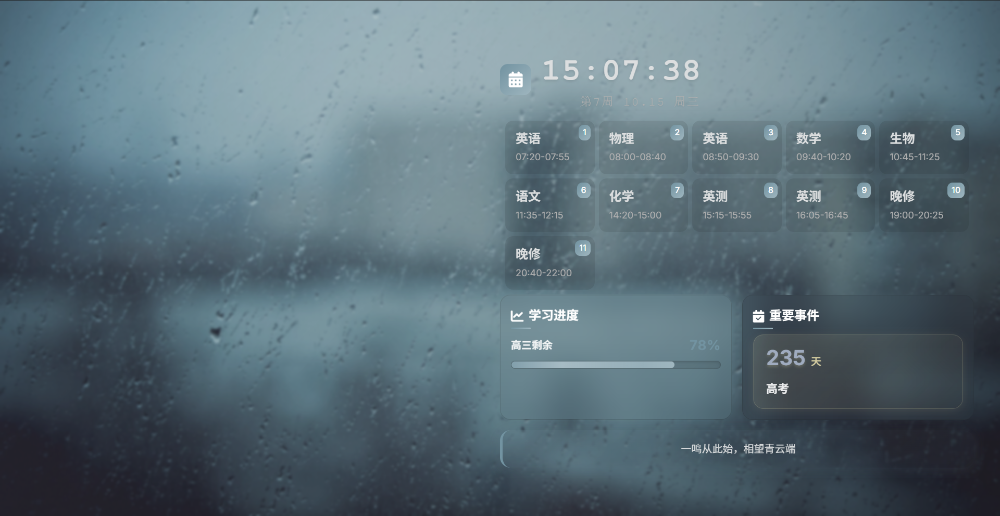
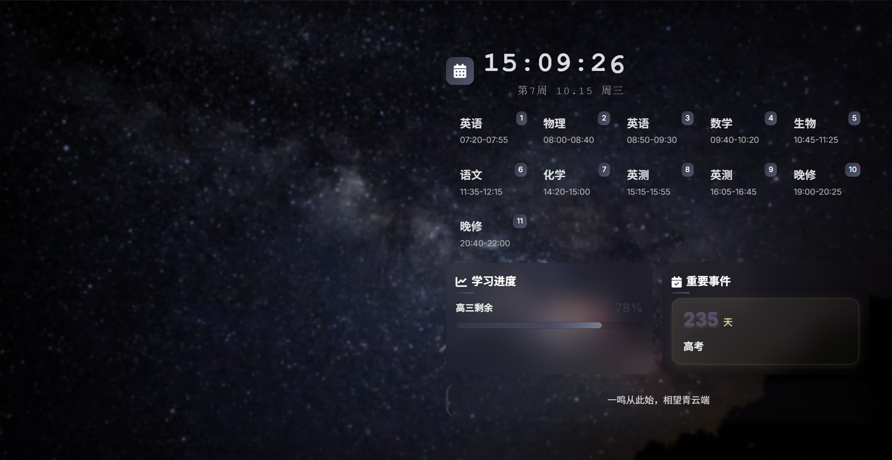

# ClassPaper v4

基于 Rust + alcro 的 Windows 桌面课程表应用，采用现代玻璃拟态设计风格。经过架构重构，实现了样式与结构的完全分离，提供了卓越的用户体验和开发维护性。

## 特性

- **玻璃拟态UI** - 半透明卡片 + 模糊背景效果，支持莫奈动态配色，提供现代感十足的视觉体验
- **翻页时钟** - 硬件加速数字翻页动画，严格固定宽度设计，精准显示时间信息
- **响应式布局** - 自适应网格系统，50%宽度设计，完美适配各种屏幕尺寸
- **智能穿透** - Windows 7/10/11 全版本兼容，确保广泛的系统支持
- **热重载** - 配置修改即时生效，提供流畅的开发和用户体验
- **本地字体** - CDN资源已转为本地文件，减少网络依赖，提高加载速度
- **模块化架构** - CSS样式与HTML结构完全分离，消除270+行重复代码，提高可维护性

## 界面



*最新截图展示了经过架构重构后的界面，保持了100%的视觉一致性*



*暗色主题*

架构重构后的技术亮点：
- **样式分离**：270+行内联CSS完全迁移到模块化外部样式表
- **代码质量**：消除重复定义，遵循DRY原则，单一职责原则
- **维护性**：主题系统支持动态配色，组件化设计易于扩展
- **性能优化**：减少代码冗余，提高加载效率
- **视觉一致性**：100%保持原有设计，零破坏性重构

## 安装

```bash
# 克隆仓库
git clone https://github.com/E7G/Classpaper-v4.git
cd Classpaper-v4

# 编译运行
cargo run --release
```

## 配置

编辑 `config.toml`：

```toml
[Default]
URL = "./res/index.html"
BrowserPath = ""  # 留空自动检测
```

前端配置在 `res/config/config.js` 中设置课程表、事件、壁纸等。

## 技术栈

- **后端**: Rust + alcro 
- **前端**: HTML5 + CSS3 + JavaScript (模块化架构)
- **样式系统**: CSS自定义属性 + 玻璃拟态设计系统
- **字体**: Inter (已本地化)
- **图标**: Font Awesome (已本地化)
- **架构原则**: DRY原则、单一职责、模块化设计

## 最近更新

### v4.2 界面优化 
- ✅ **截图更新**：添加了新的应用界面截图，展示玻璃拟态效果
- ✅ **文档完善**：更新README文档，添加更详细的功能说明
- ✅ **视觉展示**：提供多角度应用界面展示，突出设计特点

### v4.1 架构重构 
- ✅ **CSS模块化**：将270+行内联样式重构为模块化外部样式表
- ✅ **代码清理**：消除重复定义，合并相似样式，遵循DRY原则  
- ✅ **主题系统**：建立完整的CSS自定义属性系统，支持动态配色
- ✅ **零破坏性**：保持100%视觉一致性，无用户界面变化
- ✅ **性能优化**：减少代码冗余，提高样式加载效率

### 核心改进
- **样式分离**：HTML专注结构，CSS专注表现，实现真正分离
- **组件化设计**：玻璃卡片、按钮、表单等组件可复用
- **响应式增强**：统一的媒体查询系统，适配各种屏幕尺寸
- **维护性提升**：模块化结构便于后续功能扩展和样式调整

## 项目结构

```
res/
├── css/
│   ├── theme.css          # 主主题文件 - 包含所有组件样式
│   ├── all.min.css        # Font Awesome图标
│   └── css2.css           # Google字体本地化
├── js/
│   ├── core.js            # 核心功能
│   └── main.js            # 主逻辑
├── config/
│   └── config.js          # 配置文件
├── audio/                 # 通知音频
├── wallpaper/             # 壁纸图片
└── index.html             # 干净的主页面（无内联样式）
```

### 样式架构
- **CSS自定义属性**：完整的主题系统，支持明暗模式切换
- **玻璃拟态设计**：统一的毛玻璃效果和配色方案
- **组件化结构**：按钮、卡片、表单等可复用组件
- **响应式网格**：自适应布局，完美适配各种屏幕尺寸

## 许可证

MIT License