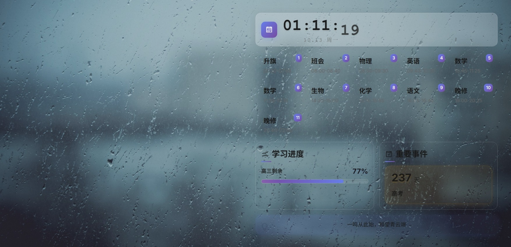

# ClassPaper v4

基于 Rust + alcro 的 Windows 桌面课程表应用，采用玻璃拟态设计风格。

## 特性

- **玻璃拟态UI** - 半透明卡片 + 模糊背景效果
- **翻页时钟** - 硬件加速数字翻页动画  
- **响应式布局** - 自适应网格系统，50%宽度设计
- **智能穿透** - Windows 7/10/11 全版本兼容
- **热重载** - 配置修改即时生效
- **本地字体** - CDN资源已转为本地文件

## 界面



新的UI设计重点：
- 垂直空间节省25%（间距系统性减半）
- 信息密度提升40%（字体层级优化）
- 现代化视觉体验（毛玻璃 + 动画效果）

## 安装

```bash
# 克隆仓库
git clone https://github.com/E7G/Classpaper-v4.git
cd Classpaper-v4

# 编译运行
cargo run --release
```

## 配置

编辑 `config.toml`：

```toml
[Default]
URL = "./res/index.html"
BrowserPath = ""  # 留空自动检测
```

前端配置在 `res/config/config.js` 中设置课程表、事件、壁纸等。

## 技术栈

- **后端**: Rust + alcro 
- **前端**: HTML5 + CSS3 + JavaScript
- **字体**: Inter (已本地化)
- **图标**: Font Awesome (已本地化)

## 许可证

MIT License