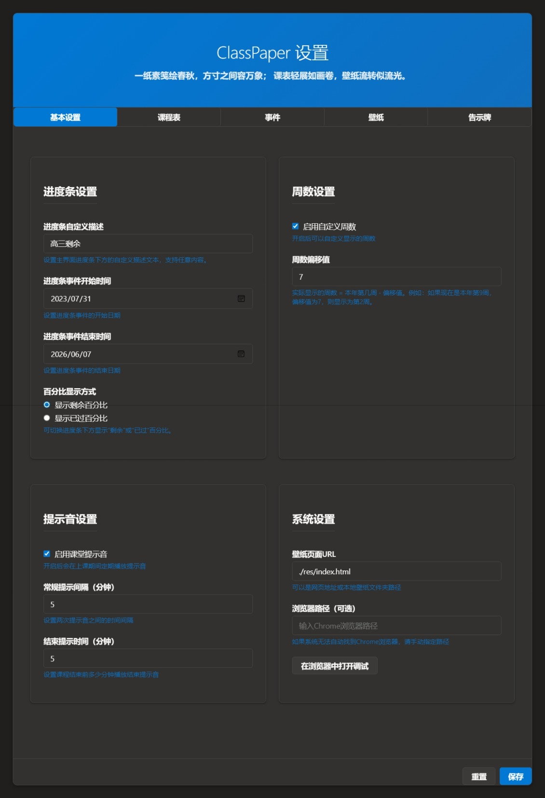
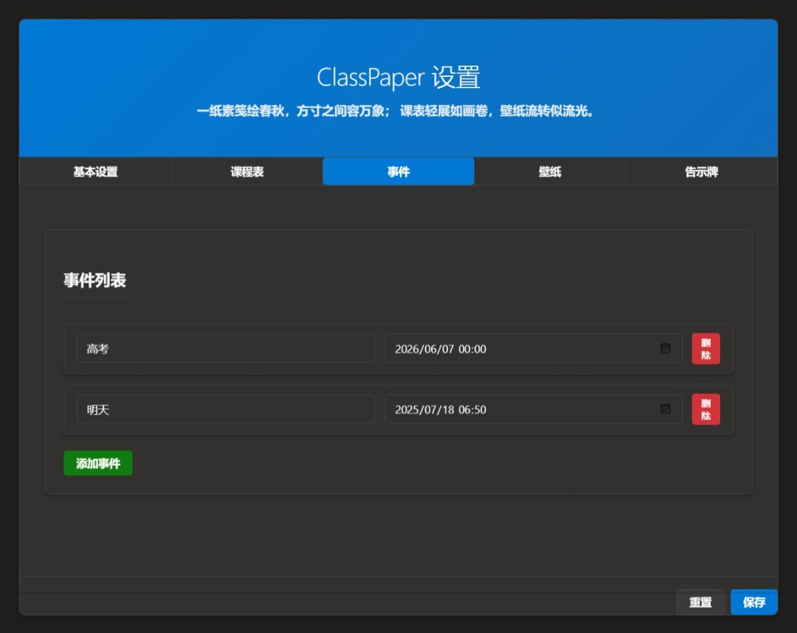
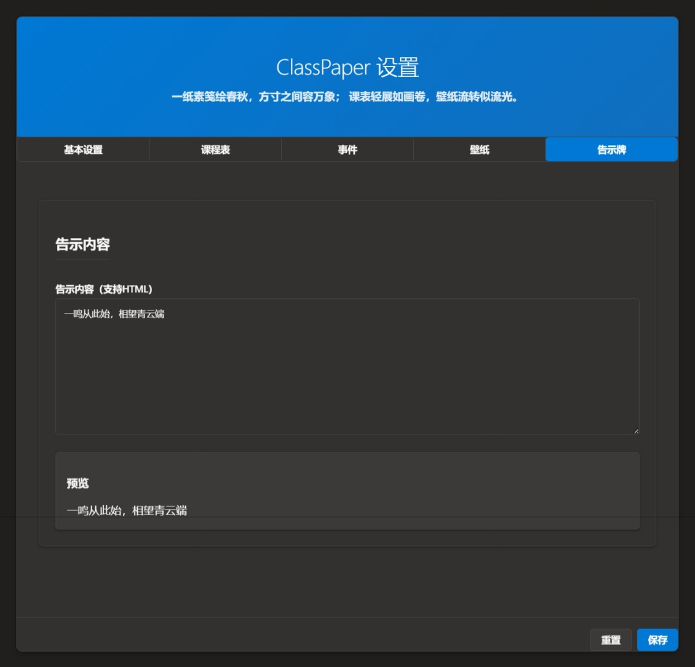

# 📚 ClassPaper v4 (Rust 版)

<div align="center">


**🎓 现代化课程表桌面应用 | 🖼️ 智能壁纸系统 | 📅 事件提醒工具**

[](https://www.rust-lang.org/)
[](https://www.microsoft.com/windows/)
[](LICENSE)
[](https://github.com/E7G/Classpaper-v4)

</div>

## 📖 简介

<div align="center">

**ClassPaper v4** 是一款基于 **Rust + alcro** 的现代化桌面课程表/壁纸/告示牌应用，专为 **Windows 系统** 优化设计。

它将网页技术与系统托盘、壁纸、音频、穿透等深度集成，为 **教室、教研室、个人学习** 等多场景提供完美的课程表展示解决方案。

</div>

### ✨ 核心亮点


| 🎯 功能特性          | 📊 技术规格                |
| -------------------- | -------------------------- |
| 🖥️**智能桌面穿透** | Windows 7/10/11 全版本兼容 |
| 🎨**动态壁纸系统**   | Rust + alcro 高性能架构    |
| 📅**课程表管理**     | 网页技术 + 系统深度集成    |
| 🔔**智能事件提醒**   | 音频 + 视觉双重提示        |
| ⚡**配置热重载**     | 修改即时生效，无需重启     |

### 🆕 新版本特性

<div align="center">


| 🔥 特性            | 📝 说明                            |
| ------------------ | ---------------------------------- |
| 🧠**智能版本检测** | 自动识别Windows版本，7→11完美适配 |
| 🔄**双重穿透方案** | 新旧方案智能切换，100%兼容性保证   |
| 💎**透明效果增强** | DWM扩展框架 + 毛玻璃效果           |
| 🛡️**防遮挡监控** | Z顺序实时监控，窗口永不被覆盖      |
| 🚨**智能错误通知** | 友好的错误提示，问题快速定位       |

</div>

---

## 🖼️ 界面展示

### 🏠 主页界面

<div align="center">


| 📅 一天模式                                                  | 📜 滚动模式                                                        |
| ------------------------------------------------------------ | ------------------------------------------------------------------ |
|  |  |

</div>

### ⚙️ 设置界面

<div align="center">


| 🔧 基础设置                                                        | 📚 课程表设置                                                              |
| ------------------------------------------------------------------ | -------------------------------------------------------------------------- |
|  |  |


| 📅 事件设置                                                          | 🖼️ 壁纸设置                                                                |
| -------------------------------------------------------------------- | ---------------------------------------------------------------------------- |
|  |  |


| 📋 告示设置                                                      |
| ---------------------------------------------------------------- |
|  |

</div>

---

## 🚀 核心功能

### 🎯 主要特性


| 🌟 功能          | 📝 描述                   | 🔧 技术实现      |
| ---------------- | ------------------------- | ---------------- |
| 📺**动态壁纸**   | 本地HTML/远程URL双支持    | 自动分辨率适配   |
| 🎛️**系统托盘** | 一键重载/重启/设置/退出   | 右键菜单集成     |
| 🖥️**桌面穿透** | win7→win11全版本智能兼容 | 双重方案自动切换 |
| ⚡**热重载**     | 配置修改即时生效          | 无需重启程序     |
| 🔊**音频提醒**   | 定时铃声/事件提示         | 上课下课智能提醒 |
| 🖼️**壁纸管理** | 文件夹扫描/自动切换       | 支持多种格式     |
| 📅**事件日历**   | HTML告示/事件展示         | 可视化日程管理   |
| 📝**日志系统**   | 详细运行状态记录          | 错误追踪与调试   |

### 🧠 智能桌面穿透

<div align="center">


| 🖥️ Windows版本 | 🔧 穿透方案  | ✨ 特性支持          |
| ---------------- | ------------ | -------------------- |
| **Windows 7**    | 传统兼容方案 | 基础穿透功能         |
| **Windows 10**   | 智能自动切换 | 根据版本选择最佳方案 |
| **Windows 11**   | 增强透明方案 | DWM + 毛玻璃效果     |
| **24H2+**        | 最新架构支持 | 完整功能体验         |

</div>

### 🔧 系统托盘功能

<div align="center">


| 🎛️ 菜单项  | 🎯 功能说明       | ⚡ 使用场景          |
| ------------ | ----------------- | -------------------- |
| **重载网页** | 刷新主窗口内容    | 内容更新后快速刷新   |
| **设置穿透** | 智能桌面穿透      | 一键设置壁纸显示     |
| **重启显示** | 重建窗口+重载配置 | 配置修改后应用       |
| **设置**     | 打开设置界面      | 课程表/壁纸/事件配置 |
| **重启程序** | 完整重载          | 升级或故障恢复       |
| **退出**     | 优雅关闭          | 无残留进程           |

</div>

---

## ⚙️ 配置文件详解

### 📋 配置文件结构

配置文件为 `config.toml`，支持 **热重载**，修改后立即生效！

<div align="center">


| 🔧 配置项     | 📝 说明            | 💡 示例                                                 |
| ------------- | ------------------ | ------------------------------------------------------- |
| `URL`         | 主页面路径         | `./res/index.html`                                      |
| `BrowserPath` | 浏览器路径（可选） | `C:\Program Files\Google\Chrome\Application\chrome.exe` |

</div>

### 🎯 推荐配置

#### 🌟 标准配置（推荐）

```toml
[Default]
URL = "./res/index.html"         # 📺 主页面路径
BrowserPath = ""                 # 🌐 浏览器路径（留空自动检测）
```

#### 🔧 高级配置示例

```toml
[Default]
URL = "./res/index.html"         # 本地课程表页面
BrowserPath = ""                 # 自动检测Chrome/Edge

# 🖼️ 壁纸设置（在设置界面中配置）
# - 支持本地文件夹：./res/wallpaper/
# - 支持网络图片：http://example.com/image.jpg
# - 支持定时切换：每30分钟自动更换
```

### 🔄 兼容性说明

- ✅ **完全兼容** Go版本配置格式
- 🔄 **自动迁移** 旧格式 → 新格式
- 📱 **热重载** 修改后立即生效
- 🎯 **智能检测** 浏览器路径自动识别

---

## 运行环境与依赖

- **操作系统**：Windows 7/10/11（推荐 64 位）
  - **Windows 7 & 早期Win10**：使用传统桌面穿透方案
  - **Windows 10 20H1+ & Windows 11**：使用增强桌面穿透方案，支持透明度和Z顺序监控
- **Rust 工具链**：建议 1.60+，需支持 2021 edition
- **alcro**：本地打补丁版，自动管理 user-data-dir，支持严格关闭
- **Chrome/Edge**：需安装任一 Chromium 内核浏览器
- **Windows API**：自动调用系统API进行版本检测、桌面穿透和错误通知
- **错误处理系统**：基于Windows原生MessageBox API的智能错误通知
- **其它依赖**：`tray-item`、`simplelog`、`ctrlc`、`serde`、`toml`、`winapi`、`once_cell` 等

---

## 📁 项目结构

### 🗂️ 目录树

```
Classpaper-v4/ 📦
├── 📁 src/                    # 🦀 主程序 Rust 源码
│   ├── 📝 main.rs            # 主程序入口
│   └── 🔧 winapi.rs          # Windows API 封装
├── 📁 alcro-patched/          # 🌐 本地打补丁的 alcro 源码
├── 📁 res/                    # 🎨 静态资源
│   ├── 📁 audio/             # 🔊 音频文件
│   ├── 📁 css/               # 🎨 样式文件
│   ├── 📁 js/                # ⚡ JavaScript 脚本
│   ├── 📁 wallpaper/         # 🖼️ 壁纸图片
│   └── 📁 screenshots/       # 📸 界面截图
├── 📄 config.toml             # ⚙️ 主配置文件
├── 📄 app.log                 # 📝 日志输出
├── 📄 README.md               # 📖 说明文档
└── 🎯 Cargo.toml             # 📦 Rust 依赖配置
```

### 🔍 关键文件


| 📄 文件             | 🎯 作用     | 📝 备注          |
| ------------------- | ----------- | ---------------- |
| `main.rs`           | 程序入口    | 包含所有主要功能 |
| `winapi.rs`         | Windows API | 桌面穿透实现     |
| `config.toml`       | 用户配置    | 支持热重载       |
| `app.log`           | 运行日志    | 错误追踪         |
| `res/index.html`    | 主页面      | 课程表展示       |
| `res/settings.html` | 设置页面    | 配置管理         |

---

## 🚀 快速开始

### ⚡ 一键安装

#### 🎯 开发者模式

```bash
# 📦 安装 Rust
curl --proto '=https' --tlsv1.2 -sSf https://sh.rustup.rs | sh

# 🏗️ 构建项目
cargo build --release

# ▶️ 运行程序
./target/release/classpaper.exe
```

#### 🖥️ 普通用户

1. **下载发布版**：[GitHub Releases](https://github.com/E7G/Classpaper-v4/releases)
2. **解压运行**：双击 `classpaper.exe`
3. **首次配置**：自动创建 `config.toml`

### 🔧 开发环境


| 💻 环境         | 📋 要求 | 🔗 下载                                         |
| --------------- | ------- | ----------------------------------------------- |
| **Rust**        | 1.60+   | [rustup.rs](https://rustup.rs/)                 |
| **Windows**     | 7/10/11 | [Microsoft](https://www.microsoft.com/windows/) |
| **Chrome/Edge** | 最新版  | [Google](https://www.google.com/chrome/)        |

### 🎮 使用流程


4. 托盘菜单管理主窗口、设置、重启、退出等

---

## 功能特性

- 支持本地网页/壁纸、远程网页一键展示
- 托盘菜单：重载网页、智能桌面穿透、重启网页显示程序、设置、重启程序、退出
- **智能Windows版本适配**：
  - 自动检测Windows版本（通过wmic命令）
  - Windows 10 build >= 19041 (20H1) 和 Windows 11：使用新版桌面穿透方案
  - 早期Windows版本：使用传统兼容方案
  - 新方案失败时自动回退，确保100%兼容性
- **增强桌面穿透技术**：
  - 窗口样式优化（去除边框、标题栏等）
  - DWM扩展框架和毛玻璃透明效果
  - Z顺序实时监控，防止被其他窗口遮挡
  - 线程安全的后台监控机制
- 配置文件自动兼容 Go/Rust 格式，支持热重载
- **本地文件自动禁用浏览器缓存，确保内容实时刷新**，远程网页默认启用缓存以保证性能
- 日志系统美观、支持多级别、自动降级输出，包含详细的版本检测和穿透状态信息
- 多窗口管理，主窗口/设置窗口均可严格关闭
- 支持壁纸轮换、进度条、事件提醒等
- **智能错误通知**：新增Windows原生错误弹窗，提供详细的错误原因和解决建议

---

## 常见问题与排查

### 🆕 错误处理与通知系统

ClassPaper v4 新增了**智能错误通知系统**，当程序遇到问题时，会通过Windows原生弹窗提供详细的错误信息和解决建议，而不仅仅是静默失败或崩溃。

#### 常见错误场景及解决方案

**1. 桌面穿透设置失败**

- **症状**：桌面穿透功能无法启用
- **错误提示**："桌面穿透设置失败"，包含具体原因和解决建议
- **解决方案**：
  - 以管理员身份运行程序
  - 检查是否有其他壁纸软件占用桌面
  - 查看 `app.log` 获取详细错误信息

**2. 配置文件读写错误**

- **症状**：配置无法保存或程序使用默认配置
- **错误提示**："配置文件操作失败"，包含文件路径和错误原因
- **解决方案**：
  - 检查 `config.toml` 文件权限
  - 确保磁盘空间充足
  - 程序会自动使用默认配置继续运行

**3. 系统托盘创建失败**

- **症状**：系统托盘图标不显示
- **错误提示**："系统托盘创建失败"，包含重试机制
- **解决方案**：
  - 程序会自动重试一次
  - 无托盘功能时仍可通过任务管理器操作

**4. 文件操作错误**

- **症状**：壁纸、音频、配置文件无法访问
- **错误提示**：具体文件路径和错误原因（权限、占用、路径错误）
- **解决方案**：
  - 检查文件权限和路径
  - 关闭占用文件的其他程序

**5. 浏览器打开失败**

- **症状**：点击链接无法打开浏览器
- **错误提示**："浏览器打开失败"，包含URL和错误原因
- **解决方案**：
  - 检查默认浏览器设置
  - 手动复制URL到浏览器访问

**6. 日志系统初始化失败**

- **症状**：无日志文件生成
- **错误提示**："日志系统初始化失败"
- **解决方案**：
  - 程序继续运行，日志输出到控制台
  - 检查磁盘空间和文件权限

#### 错误通知格式

所有错误弹窗统一格式：

```
[错误标题]

[错误描述]

可能原因：
• [原因1]
• [原因2]
• [原因3]

[解决建议]
```

#### 日志查看指南

所有错误详情都会记录在 `app.log` 文件中，包含：

- 错误发生时间
- 具体错误信息
- 错误堆栈（如适用）
- 系统版本信息

### Q: 为什么本地网页/壁纸内容变更后刷新总是生效？

A: 程序会自动为本地文件启动 Chrome 时加上禁用缓存参数，确保每次加载内容为最新。远程网页则默认启用缓存以保证加载速度和兼容性。

### Q: 如何强制远程网页不缓存？

A: 可在前端页面通过 meta 标签或 HTTP 头自行控制缓存策略，程序默认不干预远程网页缓存。

### Q: 桌面穿透在我的Windows版本上不工作怎么办？

A: 程序会自动检测Windows版本并选择合适的穿透方案：

- **Windows 10 20H1+ / Windows 11**: 使用新版方案，支持透明度和防遮挡
- **早期Windows版本**: 使用传统兼容方案
- 如果新方案失败，会自动回退到旧方案
- 查看 `app.log` 了解详细的版本检测和穿透状态信息

### Q: 为什么桌面穿透后窗口被其他应用遮挡？

A: 在Windows 10/11上，程序会启动Z顺序监控线程自动修复窗口层级。如果检测到重复冲突，监控会自动停止以避免性能问题。

### Q: 如何查看当前使用的是哪种穿透方案？

A: 查看 `app.log` 文件，程序会详细记录：

- 检测到的Windows版本信息
- 选择的穿透方案（新版本/旧版本）
- 穿透设置的成功/失败状态
- Z顺序监控的运行状态

**其他常见问题**：

- **窗口无法关闭/残留进程**：所有窗口均用 `close_blocking` 严格关闭，若遇异常请检查日志 `app.log`。
- **配置不生效**：请确认 `config.toml` 格式正确，或通过"设置"界面修改。
- **壁纸/音频无法播放**：请检查 `res/wallpaper`、`res/audio` 目录下文件是否存在。
- **托盘图标不显示**：请确保 `IDI_ICON1` 资源已正确嵌入，或重启资源管理器。
- **Chrome/Edge 未检测到**：可在配置中手动指定 `BrowserPath`。
- **panic 或管道错误**：程序已自动 sleep 并优雅退出，若仍有问题请反馈日志。

---

## 技术实现说明

### 智能错误通知系统

ClassPaper v4 引入了**智能错误通知系统**，基于Windows原生MessageBox API实现：

**核心特性**：

- **Windows原生弹窗**：使用 `MessageBoxW` API，确保与系统风格一致
- **中文错误信息**：所有错误提示使用通俗易懂的中文
- **详细错误原因**：每个错误都提供可能的具体原因
- **解决建议**：针对每种错误场景提供具体的解决步骤
- **分级处理**：
  - 致命错误：程序优雅退出
  - 重要错误：弹窗通知后继续运行
  - 一般错误：记录日志，不影响使用

**错误覆盖场景**：

- 桌面穿透设置失败
- 配置文件读写错误
- 系统托盘创建失败
- 文件操作权限问题
- 浏览器打开失败
- 日志系统初始化失败
- 壁纸目录扫描失败

### 桌面穿透技术详解

程序实现了两套桌面穿透方案，根据Windows版本自动选择：

**新版本方案 (Windows 10 20H1+ / Windows 11)**：

- 使用 `RaiseDesktop` 激活桌面壁纸窗口
- 支持DWM扩展框架 (`DwmExtendFrameIntoClientArea`) 实现透明效果
- 毛玻璃效果 (`DwmEnableBlurBehindWindow`) 增强视觉体验
- Z顺序监控线程防止窗口被遮挡
- 支持Windows 11 24H2的最新桌面架构
- 方案参考了[实现桌面动态壁纸（一）\_动态壁纸原理-CSDN博客](https://blog.csdn.net/qq_59075481/article/details/125361650)来实现

**传统方案 (Windows 7 / 早期Windows 10)**：

- 使用经典的 `Progman` + `WorkerW` 方式
- 通过 `SendMessageTimeout` 创建桌面Worker窗口
- 兼容早期Windows版本的桌面架构

### 版本检测机制

- 通过 `wmic os get Version` 命令获取准确的Windows版本信息
- 解析版本号判断是否支持新特性 (build >= 19041)
- 失败时使用默认值确保程序正常运行

### 线程安全设计

- 使用 `usize` 传递HWND指针解决线程安全问题
- Z顺序监控在独立线程中运行，不影响主程序性能
- 自动检测冲突并限制修复次数，避免无限循环

## 🧪 快速测试指南

### 测试错误通知系统

要验证新的错误处理功能，可以尝试以下场景：

1. **配置文件测试**：

   - 删除 `config.toml` 文件，程序会提示使用默认配置
   - 将 `config.toml` 设为只读，测试保存配置时的错误提示
2. **文件权限测试**：

   - 以普通用户身份运行，尝试写入系统目录
   - 删除 `res/wallpaper` 目录，测试壁纸扫描错误
3. **浏览器测试**：

   - 卸载Chrome/Edge，测试浏览器打开失败提示
   - 修改配置文件中的无效浏览器路径
4. **查看错误日志**：

   - 所有错误都会记录在 `app.log` 中
   - 包含详细的时间戳和错误堆栈信息

### 验证智能错误通知

- **桌面穿透失败**：故意设置错误的穿透参数，观察错误提示
- **系统托盘问题**：模拟托盘创建失败场景
- **日志系统**：尝试创建无权限的日志目录

所有错误都会通过Windows原生弹窗显示，确保用户能够：

- 立即了解问题原因
- 获得具体的解决步骤
- 继续正常使用程序的非核心功能

---

## 贡献与开发建议

- 欢迎提交 issue、PR 或建议
- 主要开发入口为 `src/main.rs`，alcro 补丁位于 `alcro-patched/`
- 静态资源可直接修改 `res/` 目录
- 日志输出详见 `app.log`

---

## 🤝 社区与支持

### 📞 联系方式


| 💬 渠道           | 🔗 链接                                                         | 📋 说明           |
| ----------------- | --------------------------------------------------------------- | ----------------- |
| **GitHub Issues** | [📋 提交问题](https://github.com/E7G/Classpaper-v4/issues)      | Bug报告/功能建议  |
| **Discussions**   | [💭 社区讨论](https://github.com/E7G/Classpaper-v4/discussions) | 使用心得/经验分享 |
| **QQ群**          | 暂无                                                            | 实时交流/问题解答 |
| **邮件**          | 暂无                                                            | 商务合作/深度咨询 |

### 🌟 贡献者

感谢以下开源项目和贡献者：

#### 🏗️ 技术栈


| 🛠️ 项目                                          | 📝 说明       | 🔗 链接       |
| -------------------------------------------------- | ------------- | ------------- |
| [Pico.css](https://picocss.com/)                   | 轻量级CSS框架 | 前端样式基础  |
| [alcro](https://github.com/Srinivasa314/alcro)     | Rust cdp调用浏览器        | 跨平台Web容器 |
| [winapi-rs](https://github.com/retep998/winapi-rs) | Windows API   | 系统级功能    |

#### 👥 特别感谢


| 👤 贡献者                                                                       | 🎯 贡献内容  | 🔗 链接                                                   |
| ------------------------------------------------------------------------------- | ------------ | --------------------------------------------------------- |
| [Candlest](https://github.com/Candlest)                                         | 前端文件基础 | [ClassBoard-F8](https://candlest.github.io/ClassBoard-F8) |
| [mike-unk](https://github.com/mike-unk)                                         | 前端修改建议 | [GitHub Profile](https://github.com/mike-unk)             |
| [实现桌面动态壁纸](https://blog.csdn.net/qq_59075481/article/details/125361650) | 穿透技术原理 | CSDN博客                                                  |

#### 🎨 图标与素材

- 📚 课程表图标来自 [ClassBoard-F8](https://candlest.github.io/ClassBoard-F8)
- 🎨 壁纸素材来自 [ClassBoard-F8](https://candlest.github.io/ClassBoard-F8)
- 🔊 音频素材来自 [Freesound](https://freesound.org/)

---

<div align="center">

### 🎉 支持项目

如果这个项目对您有帮助，请考虑：

⭐ **给项目点个Star** - 这是对开发者最大的鼓励！

🍺 **请我喝杯咖啡** - 支持项目持续开发

[](https://github.com/E7G/Classpaper-v4)

</div>
