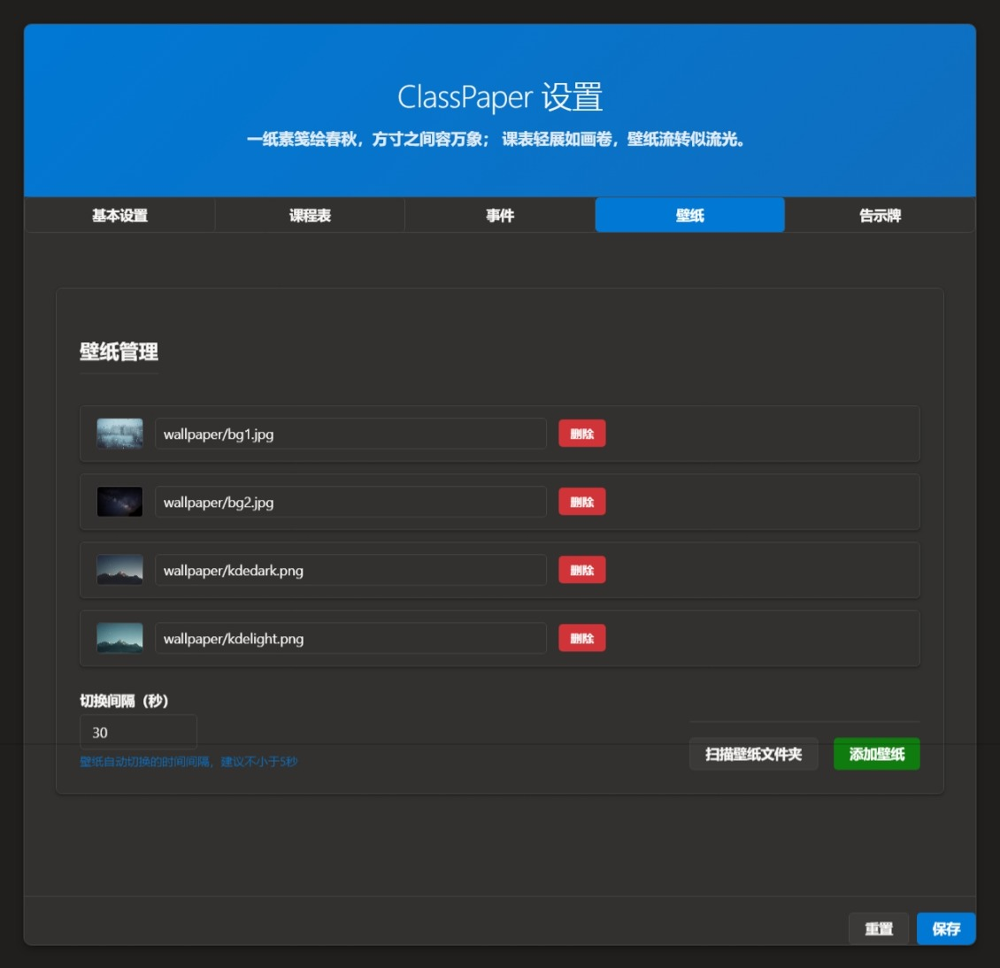

# ClassPaper v4 (Rust 版)

## 简介

ClassPaper v4 是一款基于 Rust + alcro 的现代化桌面课程表/壁纸/告示牌应用，支持 Windows 系统。它将网页技术与系统托盘、壁纸、音频、穿透等深度集成，适合教室、教研室、个人学习等多场景使用。

**🆕 新版本特性**：

- **智能Windows版本兼容**：自动检测Windows版本，支持从Windows 7到Windows 11 24H2
- **双重桌面穿透方案**：新旧两套方案自动切换，确保在所有Windows版本上都能正常工作
- **增强的透明度支持**：支持DWM扩展框架和毛玻璃效果
- **Z顺序监控**：防止桌面穿透窗口被其他应用遮挡

---


## 主页界面


---

## 设置界面





---

## 主要功能

- **网页课表/壁纸**：支持本地 HTML 或远程 URL 作为动态壁纸，自动适应分辨率。
- **系统托盘菜单**：一键重载、重启、设置、穿透、退出等操作。
- **智能桌面穿透**：
  - 自动检测Windows版本（7/10/11）并选择最佳穿透方案
  - **新方案**：适用于Windows 10 20H1+和Windows 11，支持透明度和Z顺序监控
  - **旧方案**：兼容Windows 7和早期Windows 10版本
  - 新方案失败时自动回退到旧方案，确保兼容性
- **配置热重载**：修改 `config.toml` 或设置界面后可即时生效，无需重启主程序。
- **多窗口支持**：主窗口、设置窗口等均可多开，全部随主程序优雅关闭。
- **音频提示**：支持定时播放提示音（如上课/下课铃声）。
- **壁纸管理**：支持壁纸文件夹扫描、自动切换。
- **告示牌/事件日历**：支持 HTML 告示内容、事件日历展示。
- **增强日志记录**：详细的版本检测、穿透方案选择和错误处理日志输出到 `app.log`。

---

## 托盘菜单说明


| 菜单项           | 说明                                                                    |
| ---------------- | ----------------------------------------------------------------------- |
| 重载网页         | 刷新主窗口内容，适合网页内容变更后手动刷新                              |
| 设置程序桌面穿透 | **智能桌面穿透**：自动检测Windows版本并选择最佳方案，支持透明度和防遮挡 |
| 重启网页显示程序 | 关闭并重建主窗口，应用最新配置（config.toml），并重新设置智能穿透       |
| 设置             | 打开设置窗口，支持配置热修改、壁纸管理、事件、告示牌等                  |
| 重启程序         | 重启整个主程序进程，适合升级或彻底重载                                  |
| 退出程序         | 优雅关闭所有窗口并退出，确保无残留进程                                  |

**典型场景**：

- 课表/壁纸内容变更后，点击“重载网页”或“重启网页显示程序”即可生效。
- 需要切换壁纸、调整配置时，点击“设置”进入设置界面。
- 程序异常或升级后，点击“重启程序”彻底重载。

---

## 配置文件详细说明

- 配置文件为 `config.toml`，支持热重载。
- 推荐格式（区分大小写，兼容 Go 版）：

```toml
[Default]
URL = "./res/index.html"         # 主网页/壁纸页面路径（本地或远程）
BrowserPath = ""                 # 可选：自定义 Chrome/Edge 路径
```

- 字段说明：
  - `URL`：主窗口加载的网页路径，支持本地相对路径或 http(s) URL。
  - `BrowserPath`：可选，指定 Chrome/Edge 可执行文件路径，留空则自动查找。
- 兼容旧格式 `[default] url = ... browser_path = ...`，自动迁移为新格式。

---

## 运行环境与依赖

- **操作系统**：Windows 7/10/11（推荐 64 位）
  - **Windows 7 & 早期Win10**：使用传统桌面穿透方案
  - **Windows 10 20H1+ & Windows 11**：使用增强桌面穿透方案，支持透明度和Z顺序监控
- **Rust 工具链**：建议 1.60+，需支持 2021 edition
- **alcro**：本地打补丁版，自动管理 user-data-dir，支持严格关闭
- **Chrome/Edge**：需安装任一 Chromium 内核浏览器
- **Windows API**：自动调用系统API进行版本检测和桌面穿透
- **其它依赖**：`tray-item`、`simplelog`、`ctrlc`、`serde`、`toml`、`winapi`、`once_cell` 等

---

## 目录结构说明

```
Classpaper-v4/
├── src/                # 主程序 Rust 源码
├── alcro-patched/      # 本地打补丁的 alcro 源码
├── res/                # 静态资源（html/css/js/audio/wallpaper）
├── config.toml         # 主配置文件
├── app.log             # 日志输出
├── README.md           # 本说明文档
└── ...
```

---

## 运行与构建

1. 安装 Rust 工具链（https://rustup.rs/）
2. `cargo build --release`
3. 运行 `target/release/classpaper.exe`
4. 托盘菜单管理主窗口、设置、重启、退出等

---

## 功能特性

- 支持本地网页/壁纸、远程网页一键展示
- 托盘菜单：重载网页、智能桌面穿透、重启网页显示程序、设置、重启程序、退出
- **智能Windows版本适配**：
  - 自动检测Windows版本（通过wmic命令）
  - Windows 10 build >= 19041 (20H1) 和 Windows 11：使用新版桌面穿透方案
  - 早期Windows版本：使用传统兼容方案
  - 新方案失败时自动回退，确保100%兼容性
- **增强桌面穿透技术**：
  - 窗口样式优化（去除边框、标题栏等）
  - DWM扩展框架和毛玻璃透明效果
  - Z顺序实时监控，防止被其他窗口遮挡
  - 线程安全的后台监控机制
- 配置文件自动兼容 Go/Rust 格式，支持热重载
- **本地文件自动禁用浏览器缓存，确保内容实时刷新**，远程网页默认启用缓存以保证性能
- 日志系统美观、支持多级别、自动降级输出，包含详细的版本检测和穿透状态信息
- 多窗口管理，主窗口/设置窗口均可严格关闭
- 支持壁纸轮换、进度条、事件提醒等

---

## 常见问题与排查

### Q: 为什么本地网页/壁纸内容变更后刷新总是生效？

A: 程序会自动为本地文件启动 Chrome 时加上禁用缓存参数，确保每次加载内容为最新。远程网页则默认启用缓存以保证加载速度和兼容性。

### Q: 如何强制远程网页不缓存？

A: 可在前端页面通过 meta 标签或 HTTP 头自行控制缓存策略，程序默认不干预远程网页缓存。

### Q: 桌面穿透在我的Windows版本上不工作怎么办？

A: 程序会自动检测Windows版本并选择合适的穿透方案：

- **Windows 10 20H1+ / Windows 11**: 使用新版方案，支持透明度和防遮挡
- **早期Windows版本**: 使用传统兼容方案
- 如果新方案失败，会自动回退到旧方案
- 查看 `app.log` 了解详细的版本检测和穿透状态信息

### Q: 为什么桌面穿透后窗口被其他应用遮挡？

A: 在Windows 10/11上，程序会启动Z顺序监控线程自动修复窗口层级。如果检测到重复冲突，监控会自动停止以避免性能问题。

### Q: 如何查看当前使用的是哪种穿透方案？

A: 查看 `app.log` 文件，程序会详细记录：

- 检测到的Windows版本信息
- 选择的穿透方案（新版本/旧版本）
- 穿透设置的成功/失败状态
- Z顺序监控的运行状态

**其他常见问题**：

- **窗口无法关闭/残留进程**：所有窗口均用 `close_blocking` 严格关闭，若遇异常请检查日志 `app.log`。
- **配置不生效**：请确认 `config.toml` 格式正确，或通过"设置"界面修改。
- **壁纸/音频无法播放**：请检查 `res/wallpaper`、`res/audio` 目录下文件是否存在。
- **托盘图标不显示**：请确保 `IDI_ICON1` 资源已正确嵌入，或重启资源管理器。
- **Chrome/Edge 未检测到**：可在配置中手动指定 `BrowserPath`。
- **panic 或管道错误**：程序已自动 sleep 并优雅退出，若仍有问题请反馈日志。

---

## 技术实现说明

### 桌面穿透技术详解

程序实现了两套桌面穿透方案，根据Windows版本自动选择：

**新版本方案 (Windows 10 20H1+ / Windows 11)**：

- 基于 `referrence/test.cpp` 的C++实现移植到Rust
- 使用 `RaiseDesktop` 激活桌面壁纸窗口
- 支持DWM扩展框架 (`DwmExtendFrameIntoClientArea`) 实现透明效果
- 毛玻璃效果 (`DwmEnableBlurBehindWindow`) 增强视觉体验
- Z顺序监控线程防止窗口被遮挡
- 支持Windows 11 24H2的最新桌面架构
- 方案参考了[实现桌面动态壁纸（一）\_动态壁纸原理-CSDN博客](https://blog.csdn.net/qq_59075481/article/details/125361650)来实现

**传统方案 (Windows 7 / 早期Windows 10)**：

- 使用经典的 `Progman` + `WorkerW` 方式
- 通过 `SendMessageTimeout` 创建桌面Worker窗口
- 兼容早期Windows版本的桌面架构

### 版本检测机制

- 通过 `wmic os get Version` 命令获取准确的Windows版本信息
- 解析版本号判断是否支持新特性 (build >= 19041)
- 失败时使用默认值确保程序正常运行

### 线程安全设计

- 使用 `usize` 传递HWND指针解决线程安全问题
- Z顺序监控在独立线程中运行，不影响主程序性能
- 自动检测冲突并限制修复次数，避免无限循环

## Rust/Go 迁移注意事项

- Rust 版所有窗口关闭、配置热重载、托盘菜单行为与 Go 版完全一致
- 配置文件格式兼容 Go 版，支持自动迁移
- Rust 版自动管理 Chrome user-data-dir，无需手动清理
- 关闭逻辑更安全，避免残留进程和 panic
- **新增**：智能桌面穿透技术，兼容性和稳定性大幅提升

---

## 贡献与开发建议

- 欢迎提交 issue、PR 或建议
- 主要开发入口为 `src/main.rs`，alcro 补丁位于 `alcro-patched/`
- 静态资源可直接修改 `res/` 目录
- 日志输出详见 `app.log`

---

## 联系方式/社区支持

- GitHub Issue
- 邮箱/QQ群（请在 issue 留言获取）

---

如有问题请提交 issue 或联系作者。
